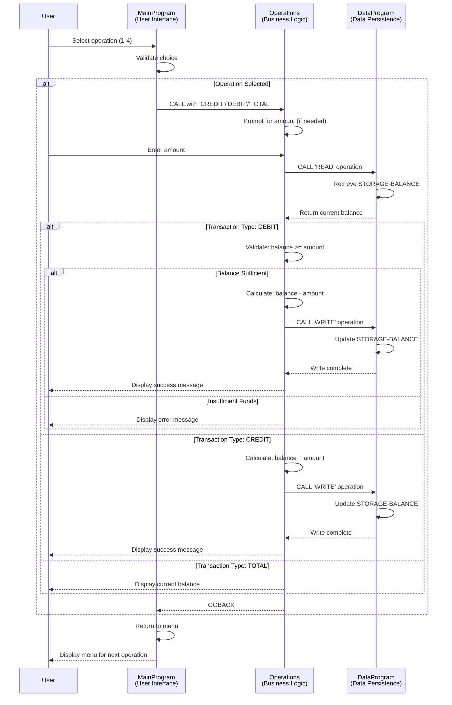

# COBOL Account Management System - Documentation

## Overview

This legacy COBOL system implements a student account management application that provides basic banking operations for account holders. The system is built using three interconnected COBOL programs that work together to manage balance inquiries, credit transactions, and debit transactions with built-in validation.

---

## COBOL Program Documentation

### 1. **main.cob** - Main Program (PROGRAM-ID: MainProgram)

#### Purpose
Serves as the entry point and user interface for the account management system. Presents an interactive menu-driven interface that guides users through available operations.

#### Key Functions
- **Menu Display**: Presents a user-friendly menu with four options
- **User Input Processing**: Accepts user choice (1-4) and routes to appropriate operations
- **Program Flow Control**: Manages the main loop until user chooses to exit

#### Menu Options
1. **View Balance** - Calls Operations program with 'TOTAL' operation
2. **Credit Account** - Calls Operations program with 'CREDIT' operation
3. **Debit Account** - Calls Operations program with 'DEBIT' operation
4. **Exit** - Terminates the program

#### Data Elements
- `USER-CHOICE` (PIC 9): Stores the user's menu selection (1-4)
- `CONTINUE-FLAG` (PIC X(3)): Controls the main loop execution (YES/NO)

---

### 2. **operations.cob** - Operations Program (PROGRAM-ID: Operations)

#### Purpose
Implements the core business logic for all account transactions. Acts as the transaction processor that handles balance queries, credits, and debits with appropriate validation and data persistence.

#### Key Functions

##### TOTAL Operation
- **Action**: Retrieves and displays the current account balance
- **Call Sequence**: Invokes DataProgram with 'READ' operation
- **Output**: Displays current balance in currency format

##### CREDIT Operation
- **Action**: Adds funds to the student account
- **Validation**: Direct credit with no restrictions
- **Process**:
  1. Prompts user for credit amount
  2. Calls DataProgram to read current balance
  3. Adds the credit amount to balance
  4. Calls DataProgram to write updated balance
  5. Displays confirmation message

##### DEBIT Operation
- **Action**: Removes funds from the student account
- **Validation**: Enforces "Insufficient Funds Rule" (see Business Rules)
- **Process**:
  1. Prompts user for debit amount
  2. Calls DataProgram to read current balance
  3. Validates that balance is sufficient (BALANCE >= AMOUNT)
  4. If valid: Deducts amount and writes updated balance
  5. If invalid: Displays error and prevents transaction

#### Data Elements
- `BALANCE` (PIC 9(6)V99): Current account balance
- `AMOUNT` (PIC 9(6)V99): Transaction amount entered by user
- `OPERATION-TYPE` (PIC X(6)): Type of operation to perform
- `PASSED-OPERATION` (PIC X(6)): Linkage section parameter from MainProgram

---

### 3. **data.cob** - Data Program (PROGRAM-ID: DataProgram)

#### Purpose
Provides data persistence layer for account balance storage and retrieval. Manages the single-record database that holds the student account balance.

#### Key Functions

##### READ Operation
- **Action**: Retrieves the current stored balance
- **Returns**: Copies STORAGE-BALANCE to the BALANCE variable passed by caller

##### WRITE Operation
- **Action**: Persists the updated balance to storage
- **Process**: Copies the BALANCE from caller to STORAGE-BALANCE

#### Data Elements
- `STORAGE-BALANCE` (PIC 9(6)V99): In-memory storage of account balance
- `BALANCE` (PIC 9(6)V99): Linkage section parameter for read/write operations
- `OPERATION-TYPE` (PIC X(6)): Specifies READ or WRITE operation

#### Initial State
- **Default Balance**: $1000.00 (1000 with 2 decimal places)

---

## Business Rules - Student Account Operations

### 1. **Insufficient Funds Protection**
- **Rule**: A debit transaction cannot exceed the current account balance
- **Enforcement**: The Operations program checks `IF BALANCE >= AMOUNT` before processing debit
- **Action on Violation**: Transaction is rejected and user receives message: "Insufficient funds. Debit not allowed."
- **Purpose**: Prevents accounts from going into overdraft

### 2. **Credit Transactions Unrestricted**
- **Rule**: Credits can be applied without upper limit restrictions
- **Purpose**: Allows deposits and tuition payments without constraints

### 3. **Balance Persistence**
- **Rule**: All balance updates are immediately written to storage via DataProgram
- **Purpose**: Ensures data consistency across multiple transactions

### 4. **Single Account Storage**
- **Implementation**: Currently uses single in-memory storage location (STORAGE-BALANCE)
- **Note**: Suitable for single-student account system; modernization would add student ID management

---

## Program Call Hierarchy

```
MainProgram (User Interface)
    └── Operations Program (Business Logic)
            └── DataProgram (Data Persistence)
```

## Data Flow

1. MainProgram presents menu and accepts user choice
2. Appropriate operation is called with operation type parameter
3. Operations program performs business logic validation
4. DataProgram is called to read/write balance as needed
5. Results are displayed to user
6. Loop returns to menu for next transaction

---

## Modernization Notes

This COBOL system demonstrates legacy banking/account management practices. Key areas for potential modernization:
- Transition to relational database (currently in-memory storage)
- Add multi-student account support with student IDs
- Implement transaction logging and audit trails
- Migrate to modern programming languages or frameworks
- Add role-based access control
- Implement comprehensive error handling and logging

---

## Data Flow Sequence Diagram

The following sequence diagram illustrates the typical data flow for a transaction operation (Credit or Debit). This shows how the three COBOL programs interact to complete a banking transaction:



### Data Flow Summary

1. **User Input**: User selects operation through MainProgram menu
2. **Operation Dispatch**: MainProgram calls Operations program with operation type
3. **User Prompt**: Operations requests amount (for CREDIT/DEBIT)
4. **Data Read**: Operations calls DataProgram with 'READ' to fetch current balance
5. **Business Logic**: Operations validates and processes the transaction
6. **Data Write**: Operations calls DataProgram with 'WRITE' to persist updated balance (if applicable)
7. **User Notification**: Operations displays transaction result
8. **Loop**: Control returns to MainProgram menu for next transaction
